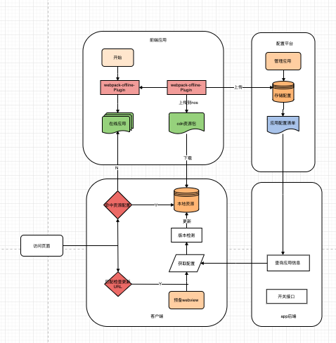

# JXHybrid
## 移动端混合框架，依托移动端离线化引擎扩展移动端开发技术壁垒
目前市场混合开发模式很多常用的模式大概有三总
1. 使用原生做基础框架依托H5为主要的页面渲染。
2. 使用阿里的weex引擎，Vue为页面渲染。
3. 使用阿里的mpaas平台，依托阿里的移动端引擎Vue离线包为页面渲染。

## 缺点：
1. 原生基础框架H5渲染H5的加载缓慢，web应用的体验无法达到原生应用的体验。但其开发效率高，被很多app所使用，做一些非核心业务的页面。
2. weex 阿里的开源引擎(已经停止维护 烂尾了)，
3. mpaas 收费较高上云产品。

### 为了满足现有APP开发周期快，迭代快的问题，打造一款原生加离线包的开发方式。
### 所用技术栈iOS+安卓+Vue+Java
### 所需工程 iOS端原生引擎，安卓原生引擎，Vue离线包脚手架，离线包管理平台，Java接口后台。

架构图
初始化 WebView -> 请求页面 -> 下载数据 -> 解析HTML -> 请求 js/css 资源 -> dom 渲染 -> 解析 JS 执行 -> JS 请求数据 -> 解析渲染 -> 下载渲染图片

