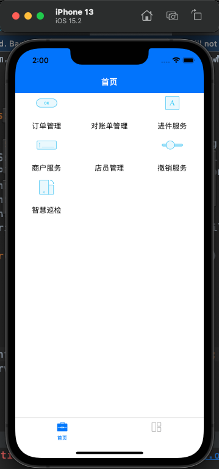
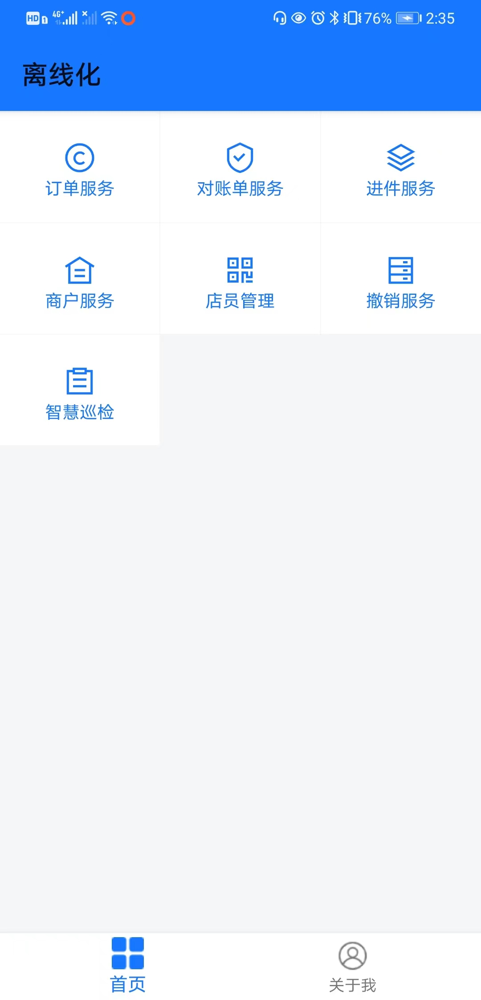
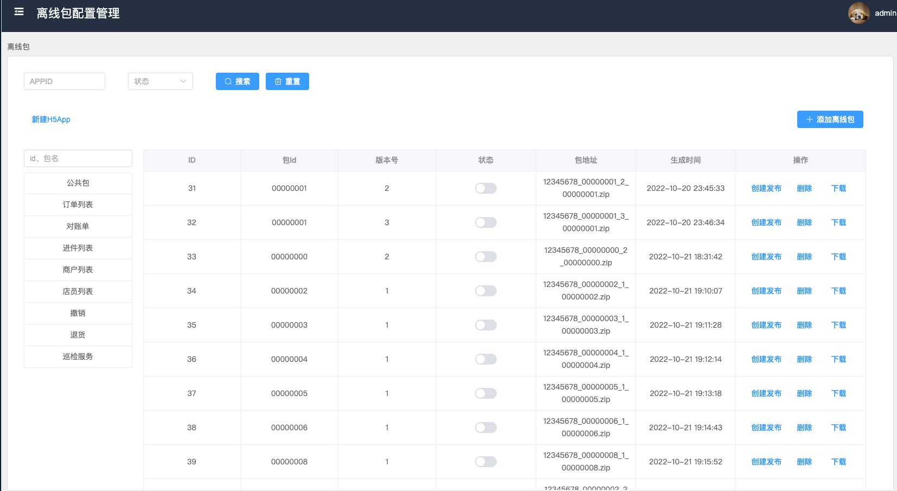

# JXHybrid
## 移动端混合框架，依托移动端离线化引擎扩展移动端开发技术壁垒
目前市场混合开发模式很多常用的模式大概有三总
1. 使用原生做基础框架依托H5为主要的页面渲染。
2. 使用阿里的weex引擎，Vue为页面渲染。
3. 使用阿里的mpaas平台，依托阿里的移动端引擎Vue离线包为页面渲染。

## 缺点：
1. 原生基础框架H5渲染H5的加载缓慢，web应用的体验无法达到原生应用的体验。但其开发效率高，被很多app所使用，做一些非核心业务的页面。
2. weex 阿里的开源引擎(已经停止维护 烂尾了)，
3. mpaas 收费较高上云产品。

### 为了满足现有APP开发周期快，迭代快的问题，打造一款原生加离线包的开发方式。
### 所用技术栈iOS+安卓+Vue+Java
### 所需工程 iOS端原生引擎，安卓原生引擎，Vue离线包脚手架，离线包管理平台，Java接口后台。

架构图
初始化 WebView -> 请求页面 -> 下载数据 -> 解析HTML -> 请求 js/css 资源 -> dom 渲染 -> 解析 JS 执行 -> JS 请求数据 -> 解析渲染 -> 下载渲染图片

## 前端应用（Web）
 保持原有的开发部署流程，仅通过webpack plugin修改打包流程，建立与配置平台的联系，并生成压缩文件，上传到NOS。这就让现有的H5应用方便的具备离线包的能力，后续新开发的离线应用也可以同时具备静态发布的能力。

## 离线包配置平台（Configuration Platform）
 用于管理各个离线包应用，包括对应用的增删改查，版本管理，配置查看，设置检查更新的url等功能，由webpack plugin生成的配置会通过接口入库。每次版本更新都会存储下来，通过上线操作生效。 

## APP后端（APP Server）
 主要提供APP侧离线包配置查询的接口，也包含ios和android离线包开启与否的开关，在配置平台设置生效的离线包应用会以列表的形式提供给APP使用。

## 客户端（APP）
 通过接口获取离线包清单，如果某个应用版本需要更新，先将本地包资源删除，再进行更新。通过整体考量，目前我们没有做增量更新和差量包的维护，为了减少应用体积过大带来的更新问题，我们提供分包的配置，可以分步实现离线化。

# iOS端原生引擎截图（源码暂时不能公开）

# 安卓原生引擎截图(源码暂时不能公开)

# 离线包管理平台

### 像提前使用的邮件联系我 wjx1018960145@163.com
